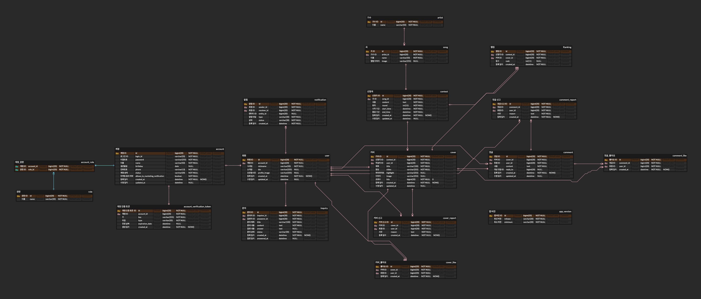
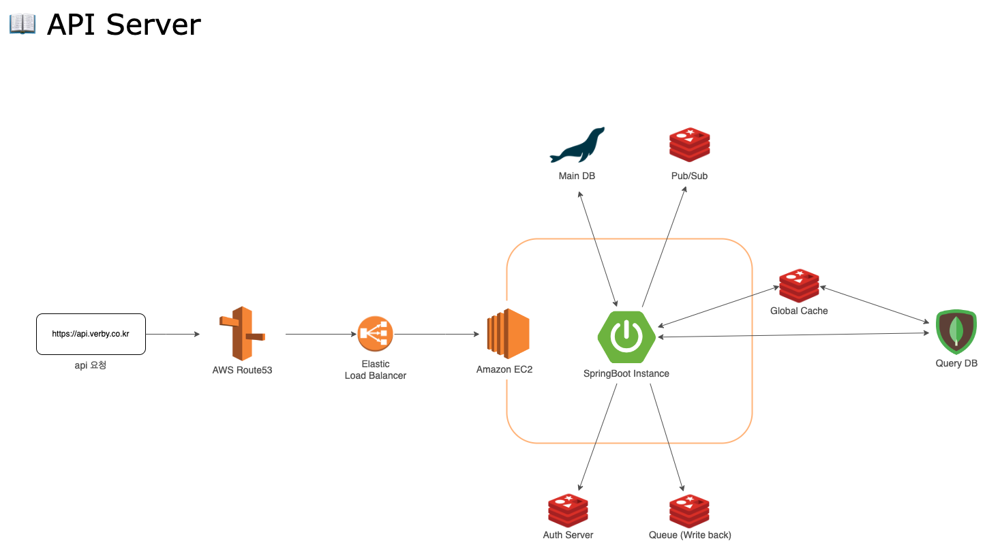
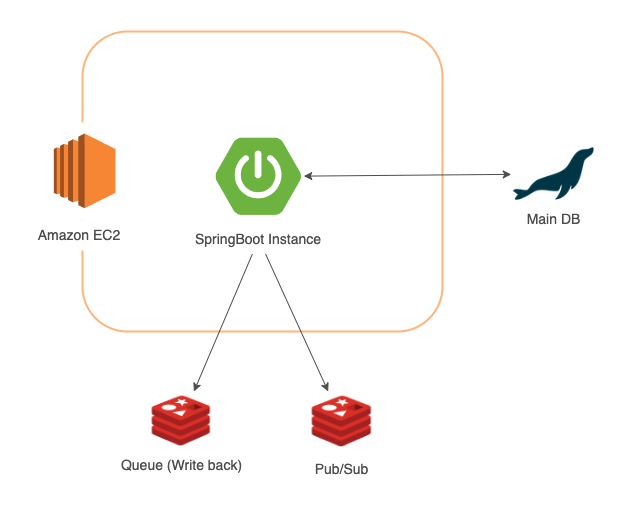
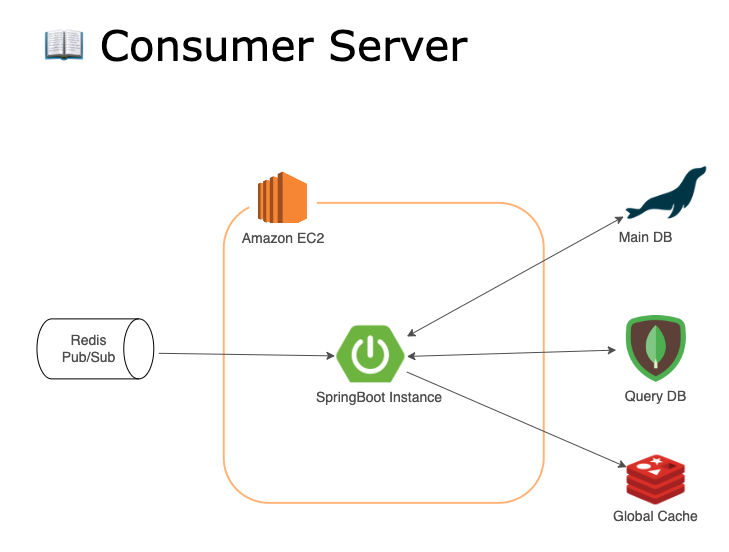
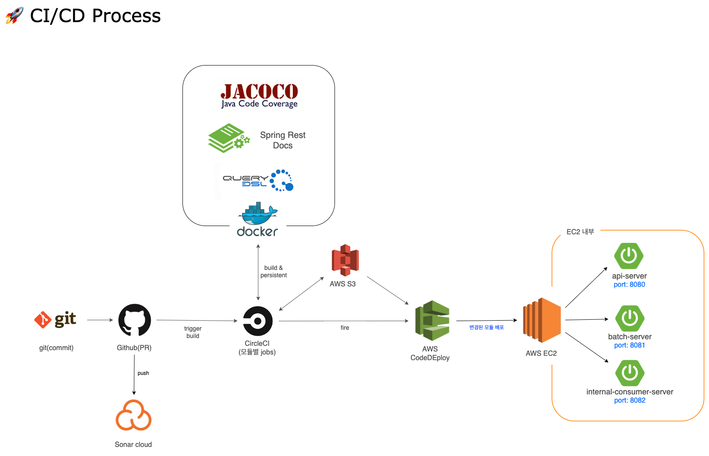

# VERBY - 커버 영상 공유 플랫폼

Verby는 <mark>Verse by</mark>의 약자로 커버 곡 영상을 공유하는 플랫폼입니다.

> API: http://api.verby.co.kr/docs/api-docs.html

--- 

## 팀 소개

### 기획

<table>
    <tr>
        <td>
            <a>
                
            </a>
        </td>
        <td>
            <a>
                
            </a>
        </td>
    </tr>
    <tr>
        <td>
            <b>박완</b>
        </td>
        <td>
            <b>정희라</b>
        </td>
    </tr>
    <tr>
        <td>
            <b>Product Owner</b>
        </td>
        <td>
            <b>Product Manager</b>
        </td>
    </tr>
</table>

### 디자인

<table>
    <tr>
        <td>
            <a>
            </a>
                
        </td>
        <td>
            <a>
                
            </a>
        </td>
        <td>
            <a>
                
            </a>
        </td>
    </tr>
    <tr>
        <td>
            <b>이윤지</b>
        </td>
        <td>
            <b>김주현</b>
        </td>
        <td>
            <b>한수민</b>
        </td>
    </tr>
    <tr>
        <td>
            <b>UI/UX Design</b>
        </td>
        <td>
            <b>UI/UX Design</b>
        </td>
        <td>
            <b>UI/UX Design</b>
        </td>
    </tr>
</table>


### 개발

<table>
    <tr>
        <td>
            <a href="https://github.com/Bigstar1108">
                
            </a>
        </td>
        <td>
            <a href="https://github.com/violetbeach">
                
            </a>
        </td>
    </tr>
    <tr>
        <td>
            <b>황대성</b>
        </td>
        <td>
            <b>이재헌</b>
        </td>
    </tr>
    <tr>
        <td>
            <b>Front-End</b>
        </td>
        <td>
            <b>Back-End</b>
        </td>
    </tr>
</table>

[Verby-Github-Repository](https://github.com/verby-korea)

## 프로젝트 소개

### 프로젝트 기간

- 기획 및 설계 : 22.06.08 ~
- 프로젝트 구현 : 22.07.27 ~
- 버그 수정 및 리팩토링 :

## 기술 스택

<div align=left>


<br>


<br>


<br>


</div>

## ERD



> Link: https://www.erdcloud.com/d/uCXnKBd5X6DAZmjhD
 
## 패키지 구조

패키지 구조는 DDD(Domain-Driven-Design)의 바운디드 컨텍스트를 기반으로 합니다.

```
com.verby.core
    +- cover
         +- command
             +- application
             |   +- CoverService.java
             |   +- CoverHitService.java
             |   +- PostCoverRequest.java
             |   +- PostedCoverInfo.java
             |   +- CoverStorageService.java
             |   +- CoverLikeService.java
             |   +- ...
             +- domain
             |   +- Cover.java
             |   +- CoverHit.java
             |   +- CoverLike.java
             |   +- CoverRepository.java
             |   +- ContestService.java
             |   +- ...
         +- query
             +- application
             |   +- CoverSummaryQueryService.java
             |   +- CoverSearchRequest.java
             |   +- CoverDetailService.java
             |   +- ...
             +- domain
             |   +- CoverQueryModel.java
             |   +- CoverQueryModelRepository.java
             |   +- ...
         +- infrastructure
         |   +- CoverQueryModelRepositoryImpl.java
         |   +- CoverServiceImpl.java
         |   +- ContestServiceImpl.java
         |   +- SongServiceImpl.java
         |   +- ...
         +- exception
         |   +- CoverExistsAlreadyException.java
      +- artist
      +- song
      +- contest
      +- ...
```

## System Architecture

### API Server



### Batch Server



### Consumer Server



## CI/CD



## 기타 문서

> 팀 전체 노션: https://bevel-buzzard-64c.notion.site/verby-3d934aa2c3044000b61361e443166d90
> 
> 백엔드 노션: https://bevel-buzzard-64c.notion.site/67bc72df37c94228a2cd6b5df488f2e3
> 
> Trouble Shooting: https://bevel-buzzard-64c.notion.site/Trouble-Shooting-003614a4bd214a92886b690c548a1eaf
